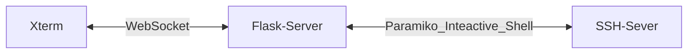

**Goal?**
Utilizing SSH without switching between my XDrive app and another CLI tool to communicate with the server.

### Usage

* Fill out the top form with the relevant data of the SSH server

### How It's Built

The project uses:
* [Xterm](xtermjs.org/) for terminal emulation.
* [WebSockets](https://flask-socketio.readthedocs.io/en/latest/) for real-time connection.
* [Paramiko](https://www.paramiko.org/) as a SSH client on the Flask server.